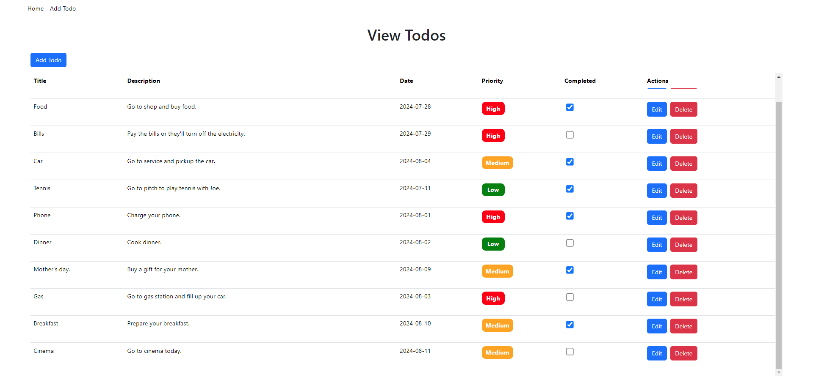

# TODO List (Spring Boot and Vue.js)

This repository contains a web application built using Vue.js for the frontend and Spring Boot for the backend. The application is designed for managing todo items and includes features for adding, updating, and viewing todo items.

## Application Screenshot
Below is a screenshot of the TODO List application showing the user interface with a list of todo items, including options to add, update, and delete items.
  

## Application functions
The web application provides several key functions to manage and display todo items efficiently. Here's an overview of its main functions:
- View todo list
- Add new todo item
- Update existing todo item
- Delete existing todo item
- Responsive UI design

## TODO Attributes
Each todo item includes the following attributes:
- ID: A unique identifier for each todo item (automatically generated).
- Title: A brief description of the todo item (up to 100 characters).
- Description: A detailed description of the todo item (up to 2000 characters).
- Priority: The importance of the todo item (Low, Medium, High).
- Date: The date by which the todo item should be completed.
- Completed: A boolean value indicating whether the todo item is completed or not.

## Backend Functions
The connection between the frontend (built with Vue.js) and the backend (built with Spring Boot) is established through a RESTful API. The backend provides a RESTful API to handle todo data management using Spring Boot. Key functions include:
- GET /todo: Retrieve the list of todos.
- GET /todo/{id}: Retrieve a todo item by ID.
- POST /todo: Add a new todo item.
- PUT /todo/{id}: Update an existing todo item by ID.
- DELETE /todo/{id}: Delete a todo item by ID.

## Technologies Used
### Frontend
- Vue.js: Framework for building user interfaces with reactive components.
- Vite: Build tool for fast development and bundling.
- Vue Router: Router for managing navigation and routing within the application.
- Bootstrap: Front-end framework for responsive and mobile-first web development.
- CSS: Custom styling for application layout and design.
### Backend
- Spring Boot: Framework for building production-ready applications quickly and efficiently.
- Spring Web: Provides support for creating RESTful web services.
- Spring Data JPA: Simplifies database access using Java Persistence API (JPA).
- Hibernate: ORM framework for mapping Java objects to database tables.
- MySQL: Database management system used for storing todo items.
- Maven: Build tool for managing dependencies and building the project.

## Running the Application
### Backend
Configure your Spring Boot application to connect to the MySQL database by updating the application.properties file. Sql script is part of the directory structure. To run the backend application locally:
- Make sure you have MySQL installed and running.
- Update application.properties with your MySQL database URL, username, and password.
- Use Maven or your preferred IDE to build and run the project.
- The backend server will be running on http://localhost:8080.
### Frontend
To run the frontend application locally: 
- Ensure you have Node.js installed.
- Clone the repository and navigate to the project directory.
- Install the dependencies.
- Start the development server.
- Open your browser and go to http://localhost:5173 to view the application.

## Testing (JUnit)
- JUnit is used to write and run tests for the application, ensuring the correctness of various functionalities.
